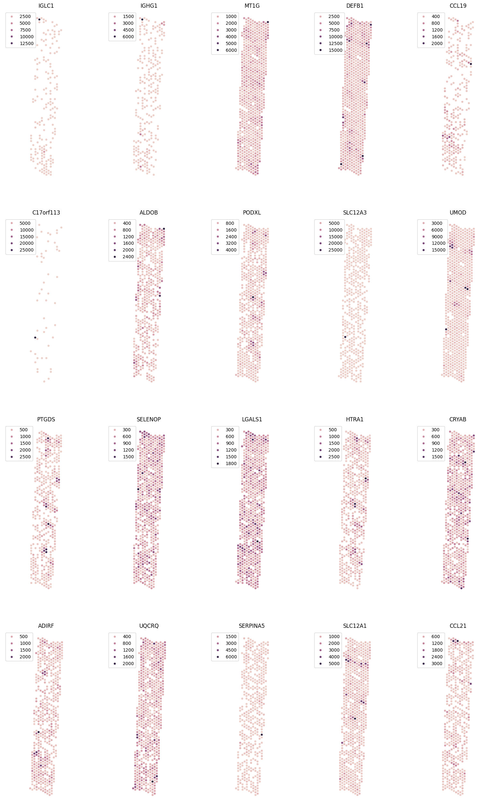
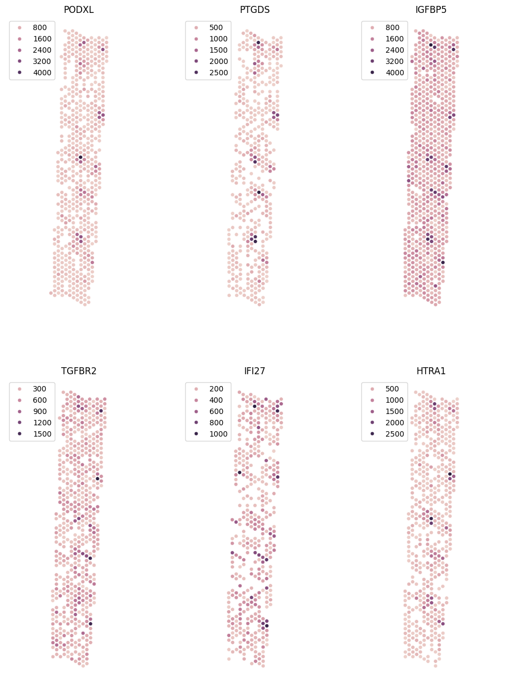

 

# PersiST

PersiST is an exploratory method for analysing spatial transcriptomics (and other 'omics) datsets. Given a spatial transcriptomics data set containing expression data on multiple genes resolved to a shared set of co-orindates, PerisST computes a single score for each gene that measures the amount of spatial structure that gene shows in it's expression pattern, called the *Coefficient of Spatial Structure* (CoSS). This score can be used for multiple analytical tasks, as we show below.

# Spatially Variable Gene Identification

For this tutorial, we shall be looking at spatial transcriptomics data on a sample from the Kidney Precision Medicine Project[1]. 


```python
import pandas as pd
df = pd.read_csv('data/kpmp_30-10125_spatial_expression.csv')
df.head()
```


<div>
<table border="1" class="dataframe">
  <thead>
    <tr style="text-align: right;">
      <th></th>
      <th>x_position</th>
      <th>y_position</th>
      <th>TSPAN6</th>
      <th>TNMD</th>
      <th>DPM1</th>
      <th>SCYL3</th>
      <th>C1orf112</th>
      <th>FGR</th>
      <th>CFH</th>
      <th>FUCA2</th>
      <th>...</th>
      <th>ENSG00000288156</th>
      <th>ENSG00000288162</th>
      <th>ENSG00000288172</th>
      <th>ENSG00000288187</th>
      <th>ENSG00000288234</th>
      <th>ENSG00000288253</th>
      <th>ENSG00000288302</th>
      <th>ENSG00000288380</th>
      <th>ENSG00000288398</th>
      <th>SOD2</th>
    </tr>
  </thead>
  <tbody>
    <tr>
      <th>0</th>
      <td>0.548810</td>
      <td>0.834208</td>
      <td>0.00000</td>
      <td>0.0</td>
      <td>0.000000</td>
      <td>0.0</td>
      <td>0.00000</td>
      <td>117.633220</td>
      <td>0.00000</td>
      <td>0.00000</td>
      <td>...</td>
      <td>0.0</td>
      <td>0.0</td>
      <td>0.0</td>
      <td>0.0</td>
      <td>0.0</td>
      <td>0.0</td>
      <td>0.0</td>
      <td>0.0</td>
      <td>0.0</td>
      <td>1058.6990</td>
    </tr>
    <tr>
      <th>1</th>
      <td>0.589610</td>
      <td>0.809106</td>
      <td>0.00000</td>
      <td>0.0</td>
      <td>0.000000</td>
      <td>0.0</td>
      <td>0.00000</td>
      <td>86.865880</td>
      <td>173.73177</td>
      <td>86.86588</td>
      <td>...</td>
      <td>0.0</td>
      <td>0.0</td>
      <td>0.0</td>
      <td>0.0</td>
      <td>0.0</td>
      <td>0.0</td>
      <td>0.0</td>
      <td>0.0</td>
      <td>0.0</td>
      <td>1737.3176</td>
    </tr>
    <tr>
      <th>2</th>
      <td>0.571644</td>
      <td>0.166174</td>
      <td>75.90709</td>
      <td>0.0</td>
      <td>75.907090</td>
      <td>0.0</td>
      <td>0.00000</td>
      <td>0.000000</td>
      <td>151.81418</td>
      <td>0.00000</td>
      <td>...</td>
      <td>0.0</td>
      <td>0.0</td>
      <td>0.0</td>
      <td>0.0</td>
      <td>0.0</td>
      <td>0.0</td>
      <td>0.0</td>
      <td>0.0</td>
      <td>0.0</td>
      <td>2201.3057</td>
    </tr>
    <tr>
      <th>3</th>
      <td>0.539074</td>
      <td>0.714422</td>
      <td>382.89725</td>
      <td>0.0</td>
      <td>127.632416</td>
      <td>0.0</td>
      <td>0.00000</td>
      <td>127.632416</td>
      <td>0.00000</td>
      <td>0.00000</td>
      <td>...</td>
      <td>0.0</td>
      <td>0.0</td>
      <td>0.0</td>
      <td>0.0</td>
      <td>0.0</td>
      <td>0.0</td>
      <td>0.0</td>
      <td>0.0</td>
      <td>0.0</td>
      <td>1148.6918</td>
    </tr>
    <tr>
      <th>4</th>
      <td>0.570493</td>
      <td>0.468741</td>
      <td>82.88438</td>
      <td>0.0</td>
      <td>0.000000</td>
      <td>0.0</td>
      <td>82.88438</td>
      <td>0.000000</td>
      <td>82.88438</td>
      <td>0.00000</td>
      <td>...</td>
      <td>0.0</td>
      <td>0.0</td>
      <td>0.0</td>
      <td>0.0</td>
      <td>0.0</td>
      <td>0.0</td>
      <td>0.0</td>
      <td>0.0</td>
      <td>0.0</td>
      <td>1989.2250</td>
    </tr>
  </tbody>
</table>
<p>5 rows × 26026 columns</p>
</div>


This is a pandas DataFrame where the first two columns correspond to the well co-ordinates, and the remaining columns contain the expression of each gene. This is the format PersiST expects spatial transcriptomics data to come in.

Let's compute CoSS scores for all the genes in this sample.


```python
from compute_persistence import run_persistence
metrics = run_persistence(df)
```

Let's take a look at those genes with the highest CoSS scores


```python
metrics = metrics.sort_values('CoSS', ascending=False)
metrics.iloc[:10,:]
```


<div>
<table border="1" class="dataframe">
  <thead>
    <tr style="text-align: right;">
      <th></th>
      <th>gene</th>
      <th>CoSS</th>
      <th>ratio</th>
      <th>gene_rank</th>
      <th>possible_artefact</th>
      <th>svg</th>
    </tr>
  </thead>
  <tbody>
    <tr>
      <th>16443</th>
      <td>IGLC1</td>
      <td>0.141620</td>
      <td>0.651803</td>
      <td>1.0</td>
      <td>No</td>
      <td>Yes</td>
    </tr>
    <tr>
      <th>16483</th>
      <td>IGHG1</td>
      <td>0.114255</td>
      <td>0.467722</td>
      <td>2.0</td>
      <td>No</td>
      <td>Yes</td>
    </tr>
    <tr>
      <th>5372</th>
      <td>MT1G</td>
      <td>0.105850</td>
      <td>0.335738</td>
      <td>3.0</td>
      <td>No</td>
      <td>Yes</td>
    </tr>
    <tr>
      <th>10798</th>
      <td>DEFB1</td>
      <td>0.103534</td>
      <td>0.376595</td>
      <td>4.0</td>
      <td>No</td>
      <td>Yes</td>
    </tr>
    <tr>
      <th>12467</th>
      <td>CCL19</td>
      <td>0.101025</td>
      <td>0.649770</td>
      <td>5.0</td>
      <td>No</td>
      <td>Yes</td>
    </tr>
    <tr>
      <th>22516</th>
      <td>C17orf113</td>
      <td>0.098336</td>
      <td>0.574433</td>
      <td>6.0</td>
      <td>No</td>
      <td>Yes</td>
    </tr>
    <tr>
      <th>6980</th>
      <td>ALDOB</td>
      <td>0.096201</td>
      <td>0.271491</td>
      <td>7.0</td>
      <td>No</td>
      <td>Yes</td>
    </tr>
    <tr>
      <th>5750</th>
      <td>PODXL</td>
      <td>0.095475</td>
      <td>0.327815</td>
      <td>8.0</td>
      <td>No</td>
      <td>Yes</td>
    </tr>
    <tr>
      <th>1102</th>
      <td>SLC12A3</td>
      <td>0.095306</td>
      <td>0.352575</td>
      <td>9.0</td>
      <td>No</td>
      <td>Yes</td>
    </tr>
    <tr>
      <th>11812</th>
      <td>UMOD</td>
      <td>0.094709</td>
      <td>0.401716</td>
      <td>10.0</td>
      <td>No</td>
      <td>Yes</td>
    </tr>
  </tbody>
</table>
</div>


```python
from plotting_utils import plot_many_genes
plot_many_genes(df, list(metrics.gene)[:20])
```


    

    


We can see that PersiST effectively surfaces those genes with notable spatial structure.

From the CoSS scores PersiST automatically calles genes as SV or not (this is the 'svg' column in the results). Once the data set has been reduced to the comparatively small number of genes PersiST typically calls as SV, in our experience simple clustering methods, such as hierarchical clustering, were effective to pick out groups of co-expressed SVGs.

Here is such a group of genes all expressed in the glomeruli of this particular sample [2].


```python
plot_many_genes(df, ['PODXL', 'PTGDS', 'IGFBP5', 'TGFBR2', 'IFI27', 'HTRA1'], numcols=3)
```


    

    


# References

[1] Blue B Lake et al. “An atlas of healthy and injured cell states and niches in the human kidney”. In: Nature
619.7970 (2023), pp. 585–594.

[2] PersiST paper (not yet published)
